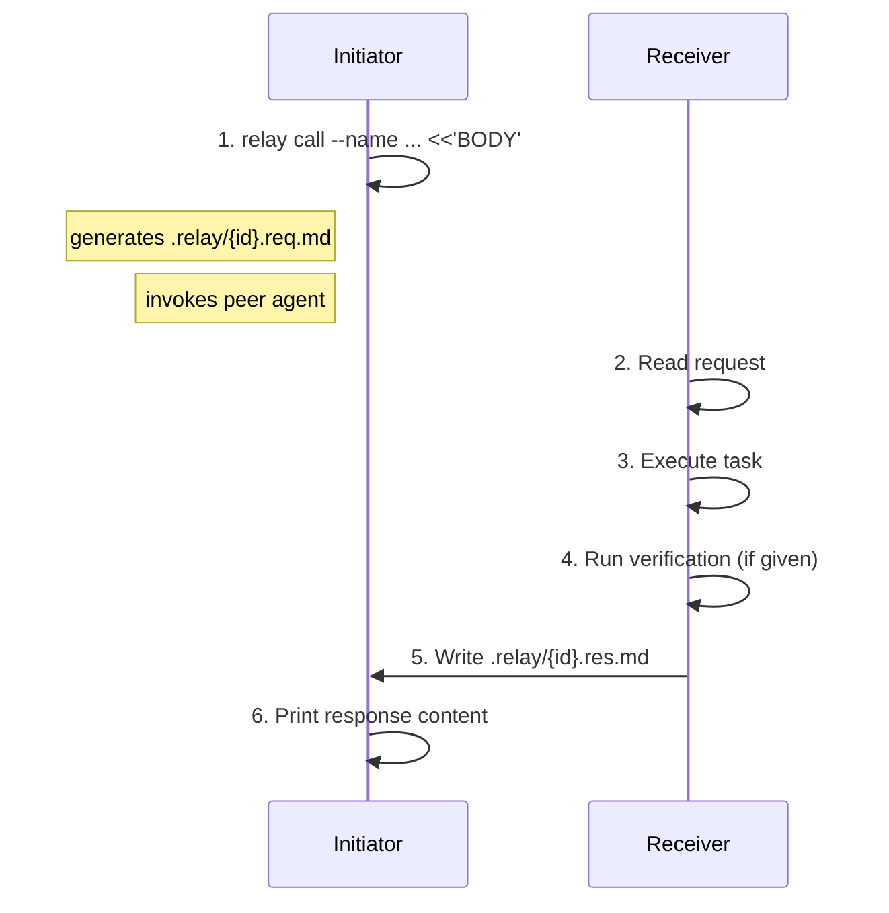

# Relay

**A skill for [Claude Code](https://docs.anthropic.com/en/docs/claude-code) and [Codex](https://github.com/openai/codex) that teaches them to talk to each other.**

> *A baton changes hands, the race continues. One agent writes the task, another picks it up and runs.*

English | [中文](README_CN.md)

Relay lets one agent call another like a function. Write a task, invoke the peer, read the result. Minimal protocol, natural language, fully auditable.

```bash
# Claude Code → Codex
relay call --name <slug> [--effort <level>] [--bg] [--body-only] <<'BODY'
task
BODY

# Codex → Claude Code
relay call --name <slug> [--effort <level>] [--body-only] <<'BODY'
task
BODY
```

Relay was built through Relay. Claude Code and Codex designed the protocol, debated trade-offs, reviewed each other's changes, and verified the result — all by passing tasks back and forth through the very skill they were creating. Every revision since has been tested and refined the same way: the skill improves itself.

## Table of Contents

- [Why](#why)
- [Philosophy](#philosophy)
- [Made by Agents, for Agents](#made-by-agents-for-agents)
- [How It Works](#how-it-works)
- [Installation](#installation)
- [Usage](#usage)
- [The Interface](#the-interface)
- [Async / Parallel](#async--parallel)
- [Utility Commands](#utility-commands)
- [Prism Integration](#prism-integration)
- [Safety](#safety)
- [Repo Structure](#repo-structure)
- [Contributors](#contributors)

---

## Why

When you run one agent, you get one model's strengths. Relay lets you compose both:

- **Delegate tasks** from one agent to the other without copy-paste
- **Get second opinions** by having one agent review the other's work
- **Run cross-model workflows** (implement with one, verify with the other)
- **Power multi-agent deliberation** — Relay is the transport layer for [Prism](https://github.com/chrisliu298/prism)'s Parallax tier

### Why not subagents?

Subagents spawn copies of the same model. Relay calls a different model — different training, different reasoning, different blind spots. A cross-model review catches more. Subagents can also invoke Relay (`/relay` in Claude Code, `$relay` in Codex), combining same-model parallelism with cross-model depth.

---

## Philosophy

Relay combines practical agent design lessons from Anthropic and OpenAI into a minimal protocol.

- **Protocol fades, task shines.** Frontmatter routes messages; the task stays in natural language. [^1]
- **Self-contained, reference-first.** A request includes the task and response template, while context stays as file references instead of pasted blobs. [^2]
- **Verification is first-class.** Responses carry `verify: pass | fail | skip` in frontmatter. Commands and evidence stay in the body. [^3]
- **Guided, not enforced.** Relay recommends a body pattern but avoids rigid schema. [^4]

These choices reduce formatting failures, keep protocol rules in one place (the request file), and let callers branch on verification without parsing prose.

---

## Made by Agents, for Agents

Relay was built by Claude Code and Codex through Relay itself: each agent researched its ecosystem, debated trade-offs across relay turns, reviewed the other's changes, and verified the result end-to-end.

The skill is meant to be edited. `SKILL.md` is plain markdown, so teams can adapt it quickly:

- Change the body pattern to match your workflow
- Add domain-specific verification commands
- Adjust the response footer template
- Swap peer names for other agent pairs

Relay stays intentionally small: no locked schema, just a readable protocol that agents and humans can extend.

---

## How It Works



The `call` subcommand wraps the full round-trip: generates the request file, invokes the peer agent, and prints the response content to stdout. The script auto-detects caller and peer from environment variables or its install path.

---

## Installation

Clone the repo and symlink both the agent-specific skill directories and the script into PATH.

```bash
git clone https://github.com/chrisliu298/relay.git ~/.cache/relay-src
```

**Claude Code:**

```bash
ln -s ~/.cache/relay-src/claude/skills/relay ~/.claude/skills/relay
```

**Codex:**

```bash
ln -s ~/.cache/relay-src/codex/skills/relay ~/.codex/skills/relay
```

**Add to PATH** (recommended — makes `relay` callable directly):

```bash
mkdir -p ~/.local/bin
ln -s ~/.cache/relay-src/scripts/relay ~/.local/bin/relay
```

Ensure `~/.local/bin` is in your PATH (it is by default on most Linux distros and can be added to `.zshenv`/`.bashrc` on macOS).

When invoked from PATH, auto-detection uses environment variables (`CLAUDECODE=1` for Claude Code, `CODEX_SANDBOX` for Codex) instead of install-path matching. For manual shell use, pass `--from`/`--to` explicitly.

**Important:** Install both agent skills from the same clone and keep them on the same version. Request/response formats must match; version skew can cause parse failures on either side.

---

## Usage

Tell your agent to delegate work:

> "Ask Codex to review the auth middleware in src/auth.py"

> "Send this to Claude for a second opinion on the caching strategy"

Or invoke directly with `/relay` (Claude Code) or `$relay` (Codex) — also available to subagents.

---

## The Interface

### Models

Each direction pins a specific model. Do **not** substitute other models — they may not be available and the call will fail.

| Direction | Model flag | Reasoning effort | Notes |
|---|---|---|---|
| Claude Code → Codex | `--model gpt-5.4` | Dynamic (`none`–`xhigh`) | Claude selects effort per task |
| Codex → Claude Code | `--model opus` | N/A | No effort parameter in Claude CLI |

### Call

One command does the full round-trip: generates the request, invokes the peer, prints the response.

**Claude Code → Codex:**

```bash
relay call --name auth-review --effort medium <<'BODY'
Review src/auth.py for security issues. Run pytest to verify.
BODY
```

**Codex → Claude Code:**

```bash
relay call --name auth-review <<'BODY'
Review src/auth.py for security issues. Run pytest to verify.
BODY
```

The `--name` flag provides a human-readable slug; the script prepends a timestamp and PID automatically (format: `YYYYMMDD-HHMMSS-PID-{name}`). The `--effort` flag controls Codex's reasoning effort (defaults to `medium`, ignored when calling Claude).

Generated request `.relay/20260219-163042-12345-auth-review.req.md`:

```markdown
---
relay: 5
id: 20260219-163042-12345-auth-review
from: claude
to: codex
effort: medium
---

Review src/auth.py for security issues. Run pytest to verify.

---
Reply: .relay/20260219-163042-12345-auth-review.res.md
Format:
  ---
  relay: 5
  re: 20260219-163042-12345-auth-review
  from: codex
  to: claude
  status: done | error
  verify: pass | fail | skip
  ---
  {your response}
```

### Output

The `call` subcommand prints the response file content to stdout. The response file:

```markdown
---
relay: 5
re: 20260219-163042-12345-auth-review
from: codex
to: claude
status: done
verify: pass
---

Found 2 issues in src/auth.py:
1. Session token not validated on line 45 — added hmac check
2. Missing input sanitization on line 52 — added parameterized query

All 12 tests pass after changes.
```

- **status**: `done` | `error`
- **verify**: `pass` | `fail` | `skip`
- **body**: findings, changes, reasoning — free-form markdown

Use `--body-only` to strip the frontmatter and get just the markdown body.

Request and response files are saved in `.relay/` (auto-gitignored). Peer stderr is logged to a `.log` sidecar file alongside the request.

If the response file is missing after invocation, the peer failed or timed out. Inspect the request, response path, and `.log` sidecar before retrying.

---

## Async / Parallel

By default, `relay call` blocks until the peer finishes. When you have independent work to do alongside a relay call, use platform-native concurrency instead of serializing.

### Claude Code

Claude Code supports `run_in_background: true` on Bash tool calls and the `--bg` script flag:

```bash
# Option 1: run_in_background on the Bash tool (agent-native)
# The relay call runs in the background while subagents do other work

# Option 2: --bg flag (script-native)
# Forks the peer invocation and returns the response path immediately
RES=$(relay call --bg --name auth-review --effort medium <<'BODY'
Review src/auth.py for security issues.
BODY
)
# RES is the expected response file path — poll with: [ -f "$RES" ] && cat "$RES"
```

### Codex

Codex supports concurrency via native parallel tool calls and subagents, but **not** via shell backgrounding (`&`/`disown`/`nohup` — child processes do not survive after the shell command returns in Codex's sandbox).

**Do not use `--bg` from Codex.** Instead, spawn a Codex subagent to run the blocking relay call while the main agent continues local work:

1. Start independent local work in parallel tool calls.
2. Spawn a subagent whose only job is to run the relay call.
3. Continue local work in the main agent.
4. Wait for the relay subagent only when you need the answer.

---

## Utility Commands

```bash
# Show usage and version
relay --help
relay --version
```

---

## Prism Integration

[Prism](https://github.com/chrisliu298/prism) is a multi-agent deliberation skill that sends the same question to multiple independent agents, each answering from a different analytical lens. Relay powers Prism's **Parallax** tier — the cross-model agent that provides model diversity.

When Prism runs from Claude Code, Parallax calls Codex via Relay. When Prism runs from Codex, Parallax calls Claude Code. The Parallax agent receives the same full question and context as every local reviewer — only the lens differs.

```bash
# Install both for the full Prism experience
git clone https://github.com/chrisliu298/prism.git ~/.claude/skills/prism
git clone https://github.com/chrisliu298/relay.git ~/.cache/relay-src
ln -s ~/.cache/relay-src/claude/skills/relay ~/.claude/skills/relay
```

Without Relay installed, Prism falls back to a same-model adversarial agent — functional but with reduced diversity.

---

## Safety

- `.relay/` is gitignored — the script handles this automatically
- **Codex** uses `--full-auto` (`workspace-write` sandbox) and `--skip-git-repo-check` (Codex refuses to run in non-git directories by default)
- **Claude** uses `--dangerously-skip-permissions` in non-interactive mode — use only in trusted repos
- Clean up: `rm .relay/*.md .relay/*.log`

---

## Repo Structure

```text
relay/
├── scripts/relay                # canonical script (single source of truth)
├── claude/skills/relay/
│   ├── SKILL.md                 # Claude-specific skill (calls Codex)
│   ├── references/
│   │   └── prompting-codex.md   # how to prompt Codex effectively
│   └── scripts/relay            # → ../../../../scripts/relay (symlink)
└── codex/skills/relay/
    ├── SKILL.md                 # Codex-specific skill (calls Claude)
    ├── references/
    │   └── prompting-claude.md  # how to prompt Claude effectively
    └── scripts/relay            # → ../../../../scripts/relay (symlink)
```

The bash script lives once at `scripts/relay`. Both platform directories symlink to it, eliminating duplication while keeping separate SKILL.md files for each agent's distinct trigger text, async patterns, and prompting guidance.

---

## Contributors

- [@chrisliu298](https://github.com/chrisliu298)
- **Claude Code** — protocol design
- **Codex** — execution contract and CLI integration

[^1]: Anthropic — [Building effective agents](https://www.anthropic.com/research/building-effective-agents), [Writing tools for agents](https://www.anthropic.com/engineering/writing-tools-for-agents); OpenAI — [A practical guide to building agents](https://openai.com/business/guides-and-resources/a-practical-guide-to-building-ai-agents/), [Unrolling the Codex agent loop](https://openai.com/index/unrolling-the-codex-agent-loop/)
[^2]: Anthropic — [Effective context engineering](https://www.anthropic.com/engineering/effective-context-engineering-for-ai-agents); OpenAI — [Conversation state](https://developers.openai.com/api/docs/guides/conversation-state), [Compaction](https://developers.openai.com/api/docs/guides/compaction)
[^3]: Anthropic — [Demystifying evals for AI agents](https://www.anthropic.com/engineering/demystifying-evals-for-ai-agents); OpenAI — [Agent evals](https://developers.openai.com/api/docs/guides/agent-evals)
[^4]: Anthropic — [Building effective agents](https://www.anthropic.com/research/building-effective-agents), [Writing tools for agents](https://www.anthropic.com/engineering/writing-tools-for-agents); OpenAI — [Function calling](https://developers.openai.com/api/docs/guides/function-calling)
