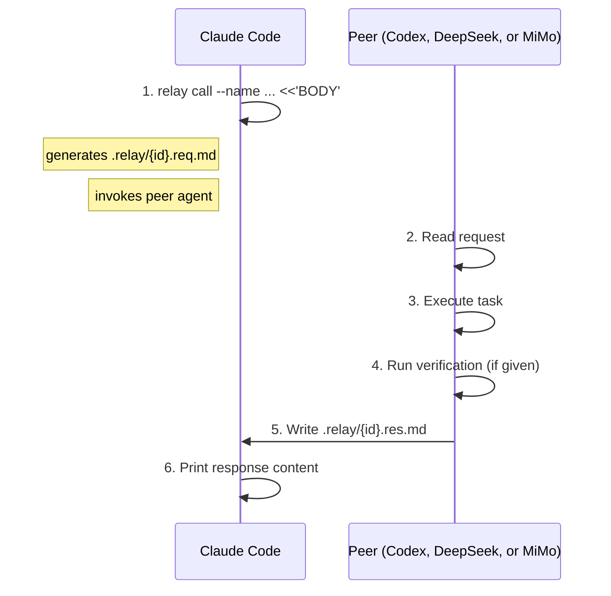

# Relay

**A skill for [Claude Code](https://docs.anthropic.com/en/docs/claude-code) that lets it delegate work to other reasoning models — currently [Codex](https://github.com/openai/codex) (GPT-5.5), [DeepSeek](https://www.deepseek.com/) V4-Pro, and [Xiaomi MiMo](https://platform.xiaomimimo.com/) V2.5-Pro.**

> *A baton changes hands, the race continues. One agent writes the task, another picks it up and runs.*

English | [中文](README_CN.md)

Relay lets Claude Code call another model like a function. Write a task, invoke the peer, read the result. Minimal protocol, natural language, fully auditable.

```bash
# Claude Code → Codex (default)
relay call --name <slug> [--effort <level>] [--body-only] <<'BODY'
task
BODY

# Claude Code → DeepSeek (always runs at max — no --effort)
relay call --to deepseek --name <slug> [--body-only] <<'BODY'
task
BODY

# Claude Code → MiMo (no effort knob)
relay call --to mimo --name <slug> [--body-only] <<'BODY'
task
BODY
```

Relay was built through Relay. Claude Code and Codex designed the protocol, debated trade-offs, reviewed each other's changes, and verified the result — all by passing tasks back and forth through the very skill they were creating. The protocol since simplified to a one-direction fan-out: Claude is the sole caller, with Codex, DeepSeek, and MiMo as targets for cross-model diversity.

## Table of Contents

- [Why](#why)
- [Philosophy](#philosophy)
- [Made by Agents, for Agents](#made-by-agents-for-agents)
- [How It Works](#how-it-works)
- [Installation](#installation)
- [Usage](#usage)
- [The Interface](#the-interface)
- [Async / Parallel](#async--parallel)
- [Utility Commands](#utility-commands)
- [Prism Integration](#prism-integration)
- [Safety](#safety)
- [Repo Structure](#repo-structure)
- [Contributors](#contributors)

---

## Why

When you run one agent, you get one model's strengths. Relay lets you compose multiple:

- **Delegate tasks** from Claude to another model without copy-paste
- **Get second opinions** by having a different-vendor model review the work
- **Run cross-model workflows** (implement with one, verify with another)
- **Power multi-agent deliberation** — Relay is the transport layer for [Prism](https://github.com/chrisliu298/prism)'s Parallax tier

### Why not subagents?

Subagents spawn copies of the same model. Relay calls a different model — different training, different reasoning, different blind spots. A cross-model review catches more. With three peer options (Codex, DeepSeek, and MiMo), you can run cross-model checks against entirely different lineages: Anthropic ↔ OpenAI ↔ DeepSeek ↔ MiMo. Subagents can also invoke Relay (`relay`), combining same-model parallelism with cross-model depth.

---

## Philosophy

Relay combines practical agent design lessons from Anthropic and OpenAI into a minimal protocol.

- **Protocol fades, task shines.** Frontmatter routes messages; the task stays in natural language. [^1]
- **Self-contained, reference-first.** A request includes the task and response template, while context stays as file references instead of pasted blobs. [^2]
- **Verification is first-class.** Responses carry `verify: pass | fail | skip` in frontmatter. Commands and evidence stay in the body. [^3]
- **Guided, not enforced.** Relay recommends a body pattern but avoids rigid schema. [^4]

These choices reduce formatting failures, keep protocol rules in one place (the request file), and let callers branch on verification without parsing prose.

---

## Made by Agents, for Agents

Relay was built by Claude Code and Codex through Relay itself: each agent researched its ecosystem, debated trade-offs across relay turns, reviewed the other's changes, and verified the result end-to-end.

The skill is meant to be edited. `SKILL.md` is plain markdown, so teams can adapt it quickly:

- Change the body pattern to match your workflow
- Add domain-specific verification commands
- Adjust the response footer template
- Swap peer names for other agent pairs

Relay stays intentionally small: no locked schema, just a readable protocol that agents and humans can extend.

---

## How It Works



The `call` subcommand wraps the full round-trip: generates the request file, invokes the peer agent, and prints the response content to stdout. The script picks the peer from `--to` (default `codex`; pass `deepseek` or `mimo` to route elsewhere).

---

## Installation

Clone the repo and symlink the skill directory plus the script into PATH.

```bash
git clone https://github.com/chrisliu298/relay.git ~/.cache/relay-src
```

**Claude Code:**

```bash
ln -s ~/.cache/relay-src ~/.claude/skills/relay
```

**Add to PATH** (recommended — makes `relay` callable directly):

```bash
mkdir -p ~/.local/bin
ln -s ~/.cache/relay-src/scripts/relay ~/.local/bin/relay
```

Ensure `~/.local/bin` is in your PATH (it is by default on most Linux distros and can be added to `.zshenv`/`.bashrc` on macOS).

**Peer prerequisites:**

- **Codex** — install the [Codex CLI](https://github.com/openai/codex). Used by default (no `--to` flag needed).
- **DeepSeek** — export `DEEPSEEK_API_KEY` in your shell (e.g., `~/.zshenv.local`). DeepSeek is reached via the `claude` CLI with an Anthropic-compatible endpoint envelope, so no separate binary install is required beyond Claude Code itself.
- **MiMo** — export `MIMO_API_KEY` in your shell (e.g., `~/.zshenv.local`). Like DeepSeek, MiMo is reached via the `claude` CLI with an Anthropic-compatible endpoint envelope — no separate binary install required.

---

## Usage

Tell your agent to delegate work:

> "Ask Codex to review the auth middleware in src/auth.py"

> "Get a second opinion from DeepSeek on the caching strategy"

Or invoke directly with `relay` — also available to subagents.

---

## The Interface

### Models

Each peer pins a specific model. Do **not** substitute other models — they may not be available and the call will fail.

| Peer (`--to`) | Model | Reasoning effort | Notes |
|---|---|---|---|
| `codex` (default) | `gpt-5.5` | `medium` / `xhigh` | Claude selects effort per task; default `medium` |
| `deepseek` | `deepseek-v4-pro` | Always `max` (DeepThink) — no `--effort` knob | Requires `DEEPSEEK_API_KEY`; reached via the `claude` CLI with DeepSeek's Anthropic-compatible endpoint. Text-only (no image input) |
| `mimo` | `mimo-v2.5-pro[1m]` | No effort knob | Requires `MIMO_API_KEY`; reached via the `claude` CLI with MiMo's Anthropic-compatible endpoint. `[1m]` enables the 1M-token context window. Text-only (no image input) |

### Call

One command does the full round-trip: generates the request, invokes the peer, prints the response.

**Claude Code → Codex (default):**

```bash
relay call --name auth-review --effort medium <<'BODY'
Review src/auth.py for security issues. Run pytest to verify.
BODY
```

**Claude Code → DeepSeek:**

```bash
relay call --to deepseek --name auth-review <<'BODY'
Review src/auth.py for security issues. Run pytest to verify.
BODY
```

**Claude Code → MiMo:**

```bash
relay call --to mimo --name auth-review <<'BODY'
Review src/auth.py for security issues. Run pytest to verify.
BODY
```

The `--name` flag provides a human-readable slug; the script prepends a timestamp and PID automatically (format: `YYYYMMDD-HHMMSS-PID-{name}`). The `--effort` flag controls Codex reasoning depth (`medium` or `xhigh`); it does not apply to DeepSeek (always `max`) or MiMo (no effort knob).

Generated request `.relay/20260219-163042-12345-auth-review.req.md`:

```markdown
---
relay: 5
id: 20260219-163042-12345-auth-review
from: claude
to: codex
effort: medium
---

Review src/auth.py for security issues. Run pytest to verify.

---
Reply: .relay/20260219-163042-12345-auth-review.res.md
Format:
  ---
  relay: 5
  re: 20260219-163042-12345-auth-review
  from: codex
  to: claude
  status: done | error
  verify: pass | fail | skip
  ---
  {your response}
```

### Output

The `call` subcommand prints the response file content to stdout. The response file:

```markdown
---
relay: 5
re: 20260219-163042-12345-auth-review
from: codex
to: claude
status: done
verify: pass
---

Found 2 issues in src/auth.py:
1. Session token not validated on line 45 — added hmac check
2. Missing input sanitization on line 52 — added parameterized query

All 12 tests pass after changes.
```

- **status**: `done` | `error`
- **verify**: `pass` | `fail` | `skip`
- **body**: findings, changes, reasoning — free-form markdown

Use `--body-only` to strip the frontmatter and get just the markdown body.

Request and response files are saved in `.relay/` (auto-gitignored). Peer stderr is logged to a `.log` sidecar file alongside the request.

If the response file is missing after invocation, the peer failed or timed out. Inspect the request, response path, and `.log` sidecar before retrying.

---

## Async / Parallel

By default, `relay call` blocks until the peer finishes. When you have independent work to do alongside a relay call, use platform-native concurrency instead of serializing.

Claude Code supports `run_in_background: true` on Bash tool calls — pass it on the Bash invocation that runs `relay`, and the call proceeds in the background while subagents and the main agent do other work. The platform sends a completion notification when the peer finishes; do not poll `.relay/` files or read the `.log` sidecar before the notification arrives.

When running multiple peers in the same dispatch step (e.g., from Prism's Parallax tier), launch each `relay` call in its own background Bash invocation — Codex, DeepSeek, and MiMo run concurrently as independent processes.

---

## Utility Commands

```bash
# Show usage and version
relay --help
relay --version
```

---

## Prism Integration

[Prism](https://github.com/chrisliu298/prism) is a multi-agent deliberation skill that sends the same question to multiple independent agents, each answering from a different analytical lens. Relay powers Prism's **Parallax** tier — the cross-model agents that provide model diversity.

With three peer options, Prism's Parallax dispatches each tier independently: a configurable number of Codex, DeepSeek, and MiMo agents launch concurrently as separate Relay calls. Each Parallax agent receives the same full question and context as every local reviewer — only the lens differs.

```bash
# Install both for the full Prism experience
git clone https://github.com/chrisliu298/prism.git ~/.claude/skills/prism
git clone https://github.com/chrisliu298/relay.git ~/.cache/relay-src
ln -s ~/.cache/relay-src ~/.claude/skills/relay
```

Without Relay installed, Prism falls back to a same-model adversarial agent — functional but with reduced diversity.

---

## Safety

- `.relay/` is gitignored — the script handles this automatically
- **Codex** uses `--full-auto` (`workspace-write` sandbox) and `--skip-git-repo-check` (Codex refuses to run in non-git directories by default)
- **DeepSeek** is invoked via the `claude` CLI with `--dangerously-skip-permissions` and the DeepSeek endpoint envelope (matches the local `_deepseek()` wrapper) — use only in trusted repos
- **MiMo** is invoked the same way via the `claude` CLI with `--dangerously-skip-permissions` and the MiMo endpoint envelope (matches the local `_mimo()` wrapper) — use only in trusted repos
- Clean up: `rm .relay/*.md .relay/*.log`

---

## Repo Structure

```text
relay/
├── SKILL.md                     # the Claude-side skill (caller)
├── peers.json                   # peer registry — single source of truth for model-family facts
├── references/
│   ├── codex.md                 # → prompt-engineer GPT/Codex guide
│   ├── gpt.md                   # → prompt-engineer GPT guide
│   └── deepseek.md              # → prompt-engineer DeepSeek guide
└── scripts/relay                # the bash script (reads peers.json; prism-launch reads it too)
```

Claude is the sole caller, so the repo is a single flat skill directory: clone it and symlink the root into `~/.claude/skills/relay`, with `scripts/relay` on PATH. The earlier `codex/skills/relay/` peer was removed when the protocol was simplified to one direction.

---

## Contributors

- [@chrisliu298](https://github.com/chrisliu298)
- **Claude Code** — protocol design
- **Codex** — execution contract and CLI integration
- **DeepSeek V4 Pro** — second peer target added 2026-05 (Anthropic-compatible endpoint envelope)
- **Xiaomi MiMo-V2.5-Pro** — third peer target added 2026-05 (Anthropic-compatible endpoint envelope)

[^1]: Anthropic — [Building effective agents](https://www.anthropic.com/research/building-effective-agents), [Writing tools for agents](https://www.anthropic.com/engineering/writing-tools-for-agents); OpenAI — [A practical guide to building agents](https://openai.com/business/guides-and-resources/a-practical-guide-to-building-ai-agents/), [Unrolling the Codex agent loop](https://openai.com/index/unrolling-the-codex-agent-loop/)
[^2]: Anthropic — [Effective context engineering](https://www.anthropic.com/engineering/effective-context-engineering-for-ai-agents); OpenAI — [Conversation state](https://developers.openai.com/api/docs/guides/conversation-state), [Compaction](https://developers.openai.com/api/docs/guides/compaction)
[^3]: Anthropic — [Demystifying evals for AI agents](https://www.anthropic.com/engineering/demystifying-evals-for-ai-agents); OpenAI — [Agent evals](https://developers.openai.com/api/docs/guides/agent-evals)
[^4]: Anthropic — [Building effective agents](https://www.anthropic.com/research/building-effective-agents), [Writing tools for agents](https://www.anthropic.com/engineering/writing-tools-for-agents); OpenAI — [Function calling](https://developers.openai.com/api/docs/guides/function-calling)
